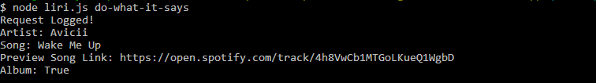

# LIRI-Node-App
Created a LIRI (Language Interpretation and Recognition Interface) node application using Twitter, Spotify, and OMDB APIs. This is an application that takes user input from the CLI and executes requests to the specified API. Each user request from the CLI is written to the log.txt file.

The application has four functions: 
1. Retrieves Tweets from my Twitter account
1. Retrieves song information from Spotify
1. Retrieves movie information from OMDB
1. Executes function specified in the random.txt file

**Technology used:** Node.js, API, and JavaScript

- - -

Below are screenshots demonstrating each function:
##### My Tweets

##### Spotify This Song

##### Movie This

##### Do What It Says
